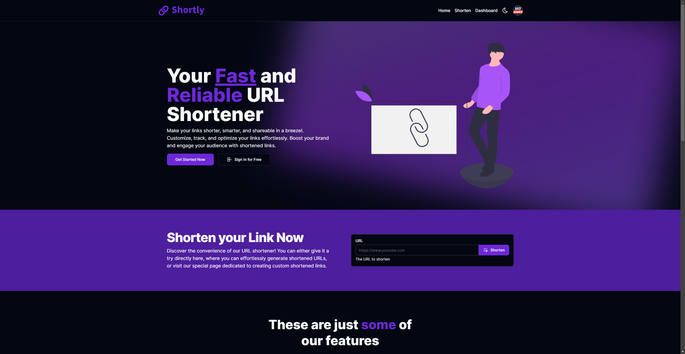

# Shortly



## ✨ About

Shortly is a free and easy to use URL Shortener webesite.

## 🚀 Installation and Usage

```sh
git clone https://github.com/faustinozanetto/shortly # First clone the repo in your folder of choice.
cd shortly # Move into the recently cloned repo.
yarn install # Install using yarn or npmotion.
yarn dev # Boot up the project using the following command.
```

## 🛠️ Technologies

The project is being developed with the latest technlogoies used in the industry like:

- TurboRepo
- NextJS
- Typescript
- TailwindCSS
- Prisma
- Husky
- ESLint
- Prettier
- React
- Commitlint
- And more :)

## 🎛️ Project Structure

The project is a structured in a mono repo so it consists of multiple separated projects. It has two main folders called `apps` and `packages` where the core tools are built.

- `apps/web`: the main [Next.js](https://nextjs.org/) app containing the frontend project for the app.
- `packages/tailwind-config-shortly`: the base config for the different uses of tailwindcss across the project.
- `packages/eslint-config-shortly`: the custom eslint configuration for the project.
- `packages/typescript-config-shortly`: the Typescript config files for each project.
- `packages/database-shortly`: a [Prisma](https://www.prisma.io/) database containing the main schema for Shortly.

## 👤 Author

**Faustino Zanetto**

- Website: [@faustinozanetto](https://faustinozanetto.vercel.app)
- Twitter: [@faustinozanetto](https://twitter.com/faustinozanetto)
- Github: [@faustinozanetto](https://github.com/faustinozanetto)
- LinkedIn: [@faustinozanetto](https://linkedin.com/in/faustino-zanetto-4294a3213)
